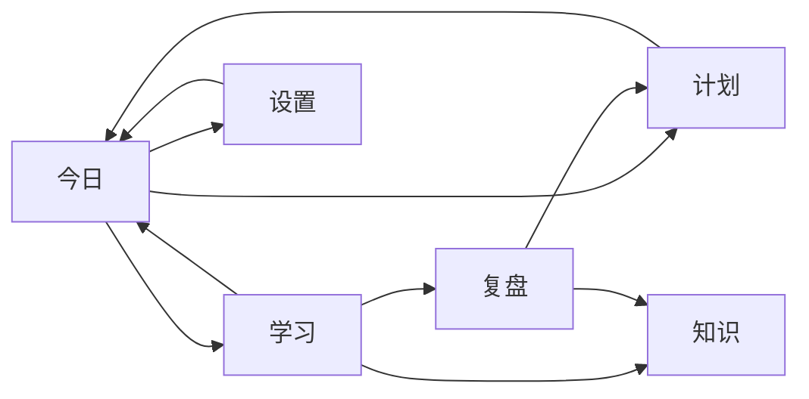

# 信息架构 V1

日期：2026-06-20
依据：`docs/PRODUCT_SCOPE_V1.md`、`docs/USER_FLOWS.md`。
范围：定义 V1 页面分工、入口层级、跳转关系和交互容器类型；不讨论具体颜色、阴影、动画或视觉风格。

## 1. 架构原则

- 一级导航保持固定且任务导向：今日、计划、学习、知识、复盘、设置。
- 今日页只回答“现在做什么”，不承载完整导入、规划、复盘或设置。
- 计划页负责把学习意图变成可确认计划。
- 学习页只执行已确认计划中的学习块。
- 复盘页负责评估当天执行，并提出可审查的计划调整建议。
- 知识页只做轻量沉淀入口，不提前建设完整 RAG 或知识图谱。
- AI 教师面板是上下文助手，不作为独立通用聊天页。
- AI 输出始终是建议；凡是会影响 confirmed plan、任务状态或知识沉淀的动作，都需要用户确认。

## 2. 一级导航

| 一级导航 | 页面职责 | 主问题 | 主要数据来源 | 主操作 |
| --- | --- | --- | --- | --- |
| 今日 | 判断当前状态，给出下一步动作 | 我现在应该学什么？ | app settings、tasks、today daily plan、active session | 根据状态动态显示：去设置、去计划、确认计划、开始学习、继续学习、去复盘 |
| 计划 | 导入/创建目标，解析任务，生成并确认草稿计划 | 如何把目标变成今天可执行的计划？ | raw imports、goals、task items、daily plans、plan versions、prompt profiles | 生成今日草稿 / 确认草稿 |
| 学习 | 执行当前学习块，记录 session 和学习输出 | 本块要做什么，做到什么程度？ | confirmed daily plan、daily plan blocks、study sessions、focus events | 开始 / 继续 / 完成学习 |
| 知识 | 保存和查看由学习产生的轻量知识条目 | 哪些内容值得以后复用？ | raw imports、session notes、review summaries、manual notes | 新建知识条目 / 保存来源内容 |
| 复盘 | 汇总当天执行，生成复盘和计划调整建议 | 今天效果如何，下一步要改什么？ | daily plan、blocks、sessions、skip logs、focus summary、ai reviews | 生成复盘 / 审查调整建议 |
| 设置 | 配置模型、学习节奏、提示词、桌面行为和隐私边界 | 应用如何运行，AI 和监控边界是什么？ | app settings、prompt profiles、prompt versions | 保存设置 |

## 3. 二级入口

## 3.1 今日

- 今日状态概览
- 当前推荐学习块
- 下一学习块摘要
- 今日完成进度
- 风险提示
- 主行动作入口
- 次要入口：
  - 去计划页
  - 去学习页
  - 去复盘页
  - 去设置页

## 3.2 计划

- 导入或创建学习输入
- 来源选择
- 提示词档位选择
- AI 解析结果检查
- 任务选择与排除
- 生成今日草稿
- 草稿计划审查
- 计划历史
- AI 计划建议接收区

## 3.3 学习

- 当前学习块
- 学习材料与要求
- Session 控制
- 学习备注
- 问题/错误记录
- 监控状态说明
- AI 教师面板
- 学习结束结算入口

## 3.4 知识

- 知识条目列表
- 来源筛选
- 关键词搜索入口
- 手动知识条目
- 从学习/复盘保存的条目
- 条目详情
- 来源回跳入口

## 3.5 复盘

- 今日执行摘要
- 完成情况
- 跳过/延期原因
- 前台应用切换摘要
- AI 复盘结果
- AI 计划调整建议
- 复盘历史
- AI 计划调整确认入口

## 3.6 设置

- DeepSeek 配置
- 学习节奏
- 每日可用学习时间窗
- 提示词档位
- 桌面行为
- 隐私与监控边界
- 数据和错误状态说明

## 4. 页面职责边界

| 页面 | 应该做 | 不应该做 |
| --- | --- | --- |
| 今日 | 根据状态给出唯一主行动作；显示当前块、下个块、风险和进度 | 大段导入、任务细节编辑、prompt 编辑、完整历史 diff、复杂报表 |
| 计划 | 导入/创建目标；解析任务；选择任务；生成、审查、确认草稿；查看计划历史 | 自动抓网页、复杂甘特图、多用户协作、AI 自动覆盖 confirmed plan |
| 学习 | 执行 confirmed plan 的学习块；记录 session、备注、完成/部分完成/跳过 | 执行未确认计划、截图监控、键盘记录、复杂倒计时动画、强制锁屏 |
| 知识 | 保存和查看轻量知识条目；保留来源和关联 | 完整 RAG、向量数据库、知识图谱、自动收集私密内容 |
| 复盘 | 汇总当天数据；生成复盘；提出可审查调整建议 | 自动修改计划、自动完成任务、长期复杂仪表盘、社交排名 |
| 设置 | 配置 AI、节奏、提示词、桌面行为、隐私边界 | 云同步、账号系统、高级模型路由、远程插件系统 |

## 5. 页面之间的跳转关系

## 5.1 主闭环跳转

## 5.2 状态驱动跳转

| 当前状态 | 今日页主操作 | 跳转目标 |
| --- | --- | --- |
| 缺 API Key | 去设置 | 设置 |
| 无任务 | 创建或导入目标 | 计划 |
| 有任务但无今日计划 | 生成今日草稿 | 计划 |
| 有草稿但未确认 | 确认计划 | 计划 |
| 有 confirmed plan 且无 active session | 开始学习 | 学习 |
| 有 active session | 继续学习 | 学习 |
| 今日主要计划已完成 | 去复盘 | 复盘 |

## 5.3 关键对象跳转

| 来源 | 目标 | 说明 |
| --- | --- | --- |
| 计划页草稿确认成功 | 今日 | 今日显示当前推荐学习块 |
| 今日当前块“开始学习” | 学习 | 基于 confirmed plan 创建或恢复 session |
| 学习页“完成/部分完成/跳过” | 学习结束结算 | 用户确认完成程度、备注、是否完成整个任务 |
| 学习结束结算确认 | 今日 / 学习 / 复盘 | 根据是否还有下一块或是否应复盘跳转 |
| 复盘页生成调整建议 | AI 计划调整确认 | 用户审查、确认、拒绝或稍后处理 |
| AI 计划调整确认通过 | 计划 | 形成新 draft plan，不直接覆盖 confirmed plan |
| 学习/复盘保存知识 | 知识 | 新知识条目保留来源引用 |
| 知识条目来源链接 | 学习 / 复盘 / 计划 | 回到来源 session、review 或 raw import |

## 6. AI 教师面板职责

AI 教师面板是上下文相关辅助区域。它不拥有独立一级导航，不应绕过页面主流程。

| 页面 | AI 教师面板职责 | 禁止事项 |
| --- | --- | --- |
| 今日 | 解释为什么推荐当前下一步；提示今日风险；说明计划未确认或 API 不可用原因 | 不生成完整计划；不直接修改任务或计划 |
| 计划 | 帮助解释解析结果；说明任务拆分、估时、依赖；解释草稿计划合理性 | 不自动确认草稿；不覆盖 confirmed plan |
| 学习 | 针对当前块提供解释、例子、提示、练习和降级建议；帮助用户判断是否达到验收标准 | 不自动标记完成；不打断学习；不请求扩大监控范围 |
| 知识 | 帮助整理条目标题、摘要、标签建议和来源说明 | 不自动保存私密内容；不自动写入用户画像 |
| 复盘 | 解释评分原因；说明调整建议影响；帮助用户理解待确认变更 | 不直接应用调整；不自动完成任务 |
| 设置 | 解释提示词档位、模型配置和隐私边界 | 不代替用户填写或暴露 API Key；不建议扩大监控范围 |

## 7. 页面、抽屉、弹窗、浮层使用规则

## 7.1 页面

适合承载完整工作流或需要稳定 URL/导航状态的内容。

- 今日
- 计划
- 学习
- 知识
- 复盘
- 设置

## 7.2 抽屉

适合在不离开当前页面的情况下查看详情、编辑辅助信息或审查上下文。

- 计划页：任务详情抽屉
- 计划页：计划历史详情抽屉
- 学习页：AI 教师面板
- 学习页：材料/备注详情抽屉
- 知识页：知识条目详情抽屉
- 复盘页：复盘历史详情抽屉
- 设置页：提示词版本历史抽屉

## 7.3 弹窗

适合需要明确确认、会造成重要状态变化或需要短表单输入的动作。

- 学习结束结算
- AI 计划调整确认
- 放弃草稿确认
- 替换当天 confirmed plan 确认
- 跳过学习块原因
- 删除或归档知识条目确认
- API Key 保存失败说明
- 监控权限或监控不可用说明

## 7.4 浮层

适合轻量提示、菜单、筛选和非阻塞状态说明。

- 导航项辅助提示
- 状态标签说明
- 任务操作菜单
- 筛选菜单
- Prompt profile 简短说明
- 监控范围提示
- 保存成功 toast
- AI 不可用提示条

## 8. AI 不可用的全局规则

- 今日：主行动作根据本地状态仍可跳转；AI 相关操作显示不可用原因。
- 计划：可以手动创建任务；AI 解析和生成草稿不可用。
- 学习：本地 session、备注、完成、跳过不受影响；AI 教师面板不可用。
- 知识：可手动保存和查看条目；AI 摘要或标签建议不可用。
- 复盘：可查看本地执行数据；AI 复盘和调整建议不可用。
- 设置：显示缺 API Key、配置错误或连接失败入口。

## 9. V1 信息架构结论

V1 的核心不是增加页面数量，而是让六个一级页面分别承担学习闭环中的一个稳定职责：

- 今日负责“下一步”。
- 计划负责“把意图变成可确认计划”。
- 学习负责“执行当前块”。
- 知识负责“沉淀来源明确的内容”。
- 复盘负责“评价和提出调整”。
- 设置负责“运行条件和边界”。

学习结束结算和 AI 计划调整确认是关键确认节点，应作为弹窗或专用确认面板出现，不能隐藏在普通说明文本里。
