# 用户流程 V1

日期：2026-06-20
依据：`docs/PRODUCT_SCOPE_V1.md`。
约束：本文件定义 V1 用户流程，不修改代码，不重新设计页面，不加入超出 `AGENTS.md` 和 `PRODUCT_SCOPE_V1.md` 的功能。

## 0. 流程总览

V1 的完整学习闭环：

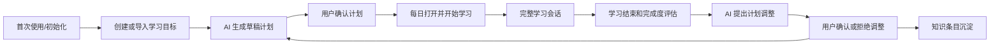

## 1. 首次使用和初始化

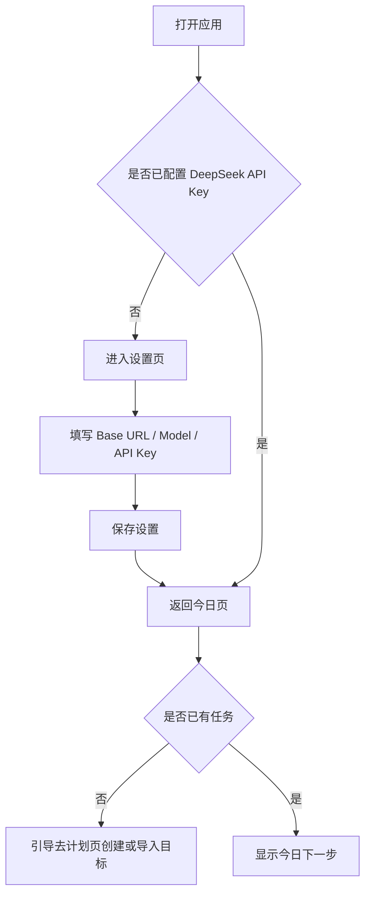

### 入口

- 应用主窗口启动。
- 托盘“打开学习管家”。
- 关闭窗口后再次打开。

### 前置条件

- 本地应用已安装或通过 `npm.cmd run dev` 启动。
- 本地数据库可访问。
- 用户未必已配置 DeepSeek API Key。

### 用户操作

1. 打开应用。
2. 查看今日页状态。
3. 如果提示缺少 API Key，进入设置页。
4. 填写 DeepSeek Base URL、模型、API Key。
5. 保存设置。
6. 返回今日页。

### 系统反馈

- 显示当前配置状态。
- API Key 保存后显示“DeepSeek 已配置”。
- 如果仍缺任务，今日页提示进入计划页创建或导入目标。
- 如果已有任务或计划，今日页显示当前下一步动作。

### 数据变化

- `app_settings` 写入或更新：
  - `deepseekBaseUrl`
  - `deepseekModel`
  - `deepseekApiKeyEncrypted`
  - `defaultBlockMinutes`
  - `dailyStudyWindows`
- 不创建任务、计划或 session。

### 异常情况

- safeStorage 不可用：API Key 保存失败，系统提示加密不可用。
- API Key 为空：保存普通设置，但不更新密钥。
- 数据库启动失败：进入启动失败状态，显示重试。
- AI provider 配置错误：后续 AI 调用失败，但初始化仍可完成本地设置。

### 用户取消后的结果

- 用户不填写 API Key：仍可查看本地数据，但不能使用导入解析、生成计划、复盘等 AI 功能。
- 用户关闭设置页或返回今日页：已有设置保持不变。

### 完成状态

- 应用能打开。
- 今日页能判断当前状态。
- DeepSeek 配置状态明确。
- 用户知道下一步是去计划页创建/导入目标，或继续已有计划。

## 2. 创建或导入学习目标

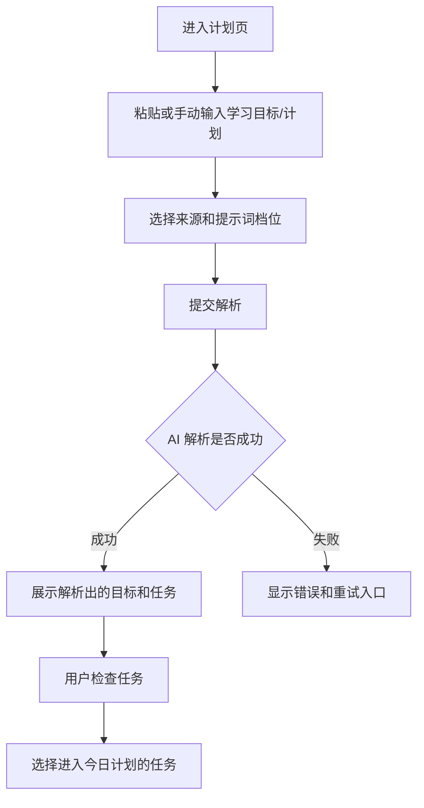

### 入口

- 今日页提示“无任务”后跳转到计划页。
- 用户从一级导航进入“计划”。
- 复盘确认调整建议后回到计划页创建新草稿。

### 前置条件

- 用户已经打开应用。
- 使用 AI 解析时需要 DeepSeek API Key。
- 用户有外部学习目标、ChatGPT/Codex 计划或手动计划文本。

### 用户操作

1. 进入计划页。
2. 粘贴学习计划或手动输入学习目标。
3. 选择来源：ChatGPT、Codex、手动。
4. 选择提示词档位。
5. 点击解析或导入。
6. 查看解析结果。
7. 保留、排除或标记本次要进入计划的任务。

### 系统反馈

- 提示正在解析。
- 解析成功后显示：
  - 目标列表。
  - 任务列表。
  - 估计时长。
  - 难度。
  - 验收标准。
  - 依赖关系。
- 解析失败后显示明确错误，并允许重试或修改输入。

### 数据变化

- 创建 `raw_imports`。
- AI 成功时创建：
  - `goals`
  - `task_items`
  - `task_dependencies`
- 保存 AI 调用记录到 `ai_reviews`，类型为 import。
- 用户选择进入今日计划的任务应影响后续计划生成输入。

### 异常情况

- 输入为空：阻止提交并提示导入文本不能为空。
- 缺 API Key：提示去设置页配置。
- AI 返回非 JSON 或 schema 不匹配：不创建正式任务，保存失败记录。
- 网络失败：显示重试。
- 解析结果质量差：用户可取消本次解析结果或重新输入。

### 用户取消后的结果

- 在提交前取消：不写入新数据。
- 在解析成功后取消：可保留 raw import，但不让任务进入今日计划。
- 取消选择任务：不生成今日计划。

### 完成状态

- 用户拥有一组可规划的本地任务。
- 用户知道哪些任务会进入下一步计划生成。
- 系统未把未经检查的 AI 输出直接变成已确认计划。

## 3. AI 生成计划并由用户确认

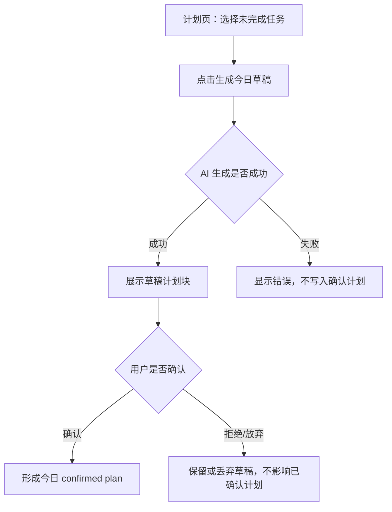

### 入口

- 计划页。
- 今日页提示“有任务无计划”后跳转到计划页。
- 复盘确认调整建议后回到计划页生成新草稿。

### 前置条件

- 已有至少一个未完成任务。
- 已配置 DeepSeek API Key。
- 已有默认学习块分钟数和每日可用学习时间窗。

### 用户操作

1. 选择要进入今日计划的任务。
2. 点击“生成今日草稿”。
3. 查看每个计划块的目标、动作、产出、验收、降级动作。
4. 决定确认、重新生成或放弃草稿。
5. 确认草稿。

### 系统反馈

- 生成中显示加载状态。
- 成功后展示草稿计划。
- 强调 AI 输出是建议，确认后才生效。
- 确认后明确显示今日 confirmed plan。
- 如果当天已有 confirmed plan，系统必须提示替换或归档规则。

### 数据变化

- AI 调用保存到 `ai_reviews`，类型为 plan。
- 成功生成时创建：
  - `daily_plans`，状态为 draft。
  - `daily_plan_blocks`。
  - `plan_versions`。
- 用户确认时：
  - draft plan 状态变为 confirmed。
  - 同日旧 confirmed plan 应进入 archived 或被明确替换。

### 异常情况

- 缺任务：不能生成，提示先创建或导入任务。
- 缺 API Key：提示去设置。
- AI 输出字段缺失：尝试本地归一化；仍失败则不写入计划。
- 用户已有 confirmed plan：必须提示影响，不能静默产生多个当前计划。
- 生成空计划：提示失败或生成保守草稿，但必须标记为草稿。

### 用户取消后的结果

- 取消生成：不创建草稿。
- 放弃草稿：不影响当前 confirmed plan。
- 重新生成：创建新草稿或覆盖未确认草稿，不能影响 confirmed plan。
- 不确认草稿：今日页仍提示计划未确认。

### 完成状态

- 当天存在一个明确的 confirmed plan。
- 今日页能读取并显示当前推荐学习块。
- 学习页可以基于 confirmed plan 开始 session。

## 4. 每天打开软件并开始学习

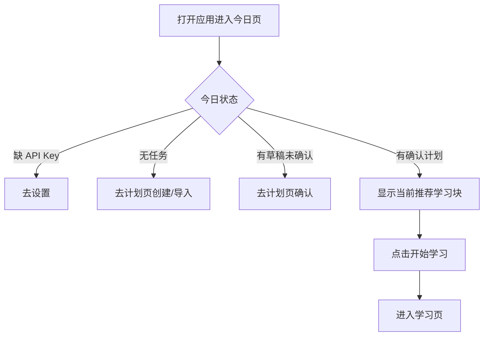

### 入口

- 应用启动。
- 托盘打开。
- 用户从任意页面回到今日页。

### 前置条件

- 本地数据库可读取。
- 今日页能查询当前日期计划、任务和 active session。

### 用户操作

1. 打开软件。
2. 查看今日页主行动作。
3. 如果已有 confirmed plan，点击“开始学习”或“继续学习”。
4. 进入学习页。

### 系统反馈

- 今日页显示当前状态和下一步。
- 有 active session 时提示继续，而不是创建新 session。
- 无 confirmed plan 时引导用户去计划页。
- 已完成主要计划时引导用户去复盘。

### 数据变化

- 仅打开今日页不应修改数据。
- 点击开始学习后创建或恢复 `study_sessions`。
- 进入学习页后显示当前 block。

### 异常情况

- 今日有多个 confirmed plan：必须提示冲突，要求用户选择或让系统归档旧计划。
- 计划块为空：不能进入学习，返回计划页修复。
- active session 存在但 block 已被删除或状态异常：提示恢复失败并进入计划页。

### 用户取消后的结果

- 用户不点击开始：无数据变化。
- 用户返回计划页：无 session 创建。
- 用户关闭窗口：应用可驻留托盘，当前状态不变。

### 完成状态

- 用户进入学习页。
- 系统展示当前学习块。
- 学习 session 准备开始或已恢复。

## 5. 完整学习会话

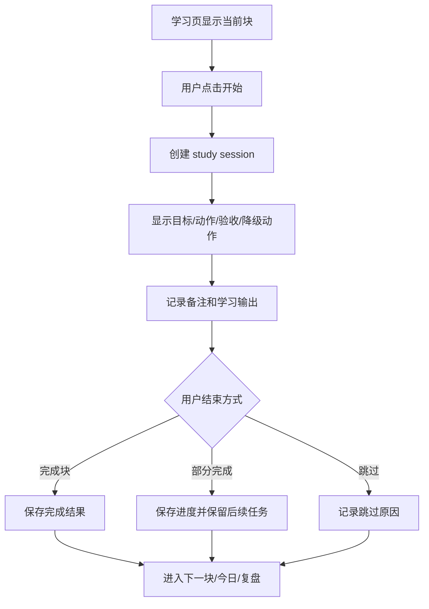

### 入口

- 今日页“开始学习”。
- 学习页“继续学习”。
- 计划页从 confirmed plan 的某个块进入学习。

### 前置条件

- 存在 confirmed plan。
- 存在可执行的 planned 或 active block。
- 用户未处于冲突的 active session，或系统能恢复当前 active session。

### 用户操作

1. 查看当前块目标、动作、材料、预期输出、验收标准。
2. 点击开始或继续。
3. 学习过程中记录备注、问题、错误或输出。
4. 根据实际情况选择完成、部分完成、暂停或跳过。
5. 如果完成，判断是否也完成整个任务。

### 系统反馈

- 明确显示 session 已开始。
- 显示监控范围和当前是否正在记录前台应用。
- 显示当前块状态。
- 保存备注后显示已保存状态。
- 完成或跳过后提示下一步：下一块、今日页或复盘。

### 数据变化

- 开始时：
  - 创建 `study_sessions`。
  - block 状态变为 active。
  - 启动 focus monitor。
- 学习中：
  - 记录 `focus_events`。
  - 更新备注。
- 完成时：
  - session 状态变为 completed。
  - block 状态变为 done 或 partially completed 对应状态。
  - 任务是否 done 由用户确认或任务所有块完成判断。
- 跳过时：
  - block 状态变为 skipped。
  - 写入 `skip_logs`。

### 异常情况

- 监控不可用：session 继续，记录监控不可用事件。
- 应用关闭：session 保留 active 或 paused 状态，下次打开可恢复。
- 数据库写入失败：提示保存失败，不应误报完成。
- 用户开始已完成块：阻止或提示选择其他块。
- API 不可用：不影响本地学习 session。

### 用户取消后的结果

- 开始前取消：不创建 session。
- 学习中取消或返回：session 应进入 paused 或保持 active，并能恢复。
- 完成确认前取消：block 不应变为 done。
- 跳过原因未填写：不跳过，保持原状态。

### 完成状态

- session 有明确结束状态。
- block 状态与用户选择一致。
- 用户可以进入下一块或复盘。
- 学习备注可作为知识条目来源。

## 6. 暂停、退出和异常中断学习

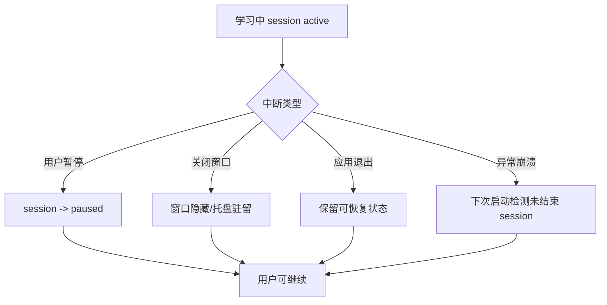

### 入口

- 学习页。
- 用户点击暂停。
- 用户关闭窗口。
- 用户从托盘退出。
- 应用异常中断后重新启动。

### 前置条件

- 存在 active study session。
- 当前学习块处于 active。

### 用户操作

1. 点击暂停，或关闭窗口，或退出应用。
2. 重新打开应用。
3. 今日页或学习页提示继续未完成 session。
4. 用户选择继续、结束、放弃或标记中断。

### 系统反馈

- 暂停后显示 session 已暂停。
- 关闭窗口时说明应用仍在托盘运行。
- 重启后显示检测到未结束 session。
- 继续后恢复学习页状态。

### 数据变化

- 暂停：
  - session 状态变为 paused。
  - 停止 focus monitor。
- 关闭窗口但不退出：
  - 如果 session 仍 active，继续或暂停策略必须明确。
- 退出或崩溃：
  - 下次启动读取未结束 session。
  - 不应丢失 session 记录。

### 异常情况

- session 存在但 block 不存在：提示无法恢复，允许结束异常 session。
- focus monitor 未正常停止：启动时重新校正状态。
- 应用退出时数据库写入失败：下次启动提示状态可能不完整。

### 用户取消后的结果

- 取消暂停：继续 active session。
- 取消恢复：session 保持 paused 或提示用户稍后处理。
- 取消结束：不改变 block 状态。

### 完成状态

- 中断不会造成任务误完成。
- 用户能清楚知道当前学习是否仍在进行。
- 系统能恢复或安全结束异常 session。

## 7. 学习结束和完成度评估

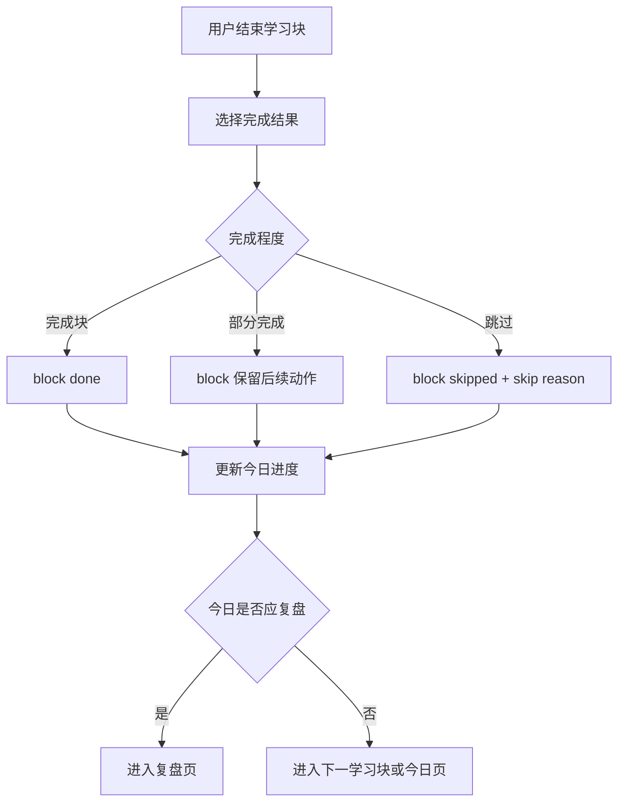

### 入口

- 学习页点击完成。
- 学习页点击部分完成。
- 学习页点击跳过。
- 今日页检测今日计划接近完成。

### 前置条件

- 存在 study session。
- 当前 block 有明确状态。

### 用户操作

1. 点击结束动作。
2. 填写学习输出或备注。
3. 选择完成程度。
4. 如果跳过，填写原因。
5. 如果任务整体完成，明确确认任务完成。

### 系统反馈

- 显示本块保存成功。
- 显示当前完成度。
- 显示是否进入下一块或复盘。
- 如果任务未整体完成，提示后续仍会规划。

### 数据变化

- 更新 `study_sessions`：
  - endedAt。
  - durationMinutes。
  - status。
  - notes。
- 更新 `daily_plan_blocks` 状态。
- 可选更新 `task_items` 状态，但必须有明确规则或用户确认。
- 跳过时写入 `skip_logs`。

### 异常情况

- 用户未填写必要输出：可允许完成但提示输出为空会影响复盘质量。
- 数据保存失败：不切换 UI 到完成状态。
- 重复点击完成：必须防止重复结束同一 session。

### 用户取消后的结果

- 取消完成：session 保持 active 或 paused。
- 取消跳过：block 不变。
- 取消任务整体完成：只完成 block，不完成 task。

### 完成状态

- 本次 session 有可信结束记录。
- 今日进度更新。
- 复盘页能读取当天准确数据。

## 8. AI 提出计划调整

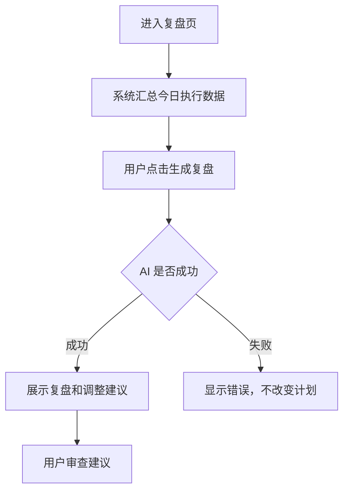

### 入口

- 今日页提示“去复盘”。
- 学习结束后跳转复盘页。
- 用户从一级导航进入复盘。

### 前置条件

- 当天有计划或 session 数据。
- 已配置 DeepSeek API Key。
- 复盘页能按日期读取当天数据。

### 用户操作

1. 进入复盘页。
2. 查看今日数据摘要。
3. 点击生成复盘。
4. 阅读 AI 总结和调整建议。

### 系统反馈

- 显示生成中。
- 成功后展示：
  - 完成度。
  - 专注度。
  - 难度匹配。
  - 问题原因。
  - 下一步建议。
  - 具体计划调整 proposal。
- 强调建议未应用。

### 数据变化

- 保存 AI review 或 review record。
- 保存调整 proposal，状态为 pending。
- 不修改 confirmed plan。
- 不自动修改 task 状态。

### 异常情况

- 缺 API Key：提示去设置。
- 当天数据不足：提示可先完成学习或手动写复盘。
- AI 失败：保存失败记录，不改变计划。
- AI 建议不符合 schema：提示失败或重试，不持久化为可应用建议。

### 用户取消后的结果

- 取消生成：不写入 AI review。
- 生成后离开页面：pending 建议仍可从复盘历史找回。
- 不处理建议：不影响当前计划。

### 完成状态

- 用户看到可审查的复盘结果。
- 系统保存了复盘记录。
- 如果有调整建议，状态为待确认。

## 9. 用户确认或拒绝计划调整

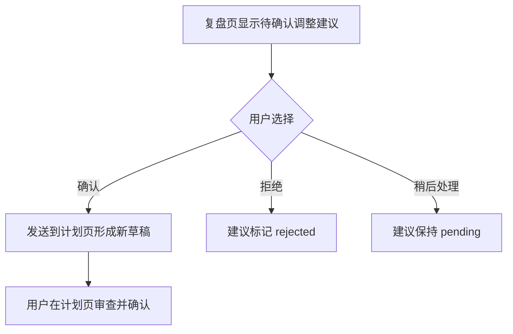

### 入口

- 复盘页 AI 调整建议区域。
- 复盘历史中的 pending 建议。

### 前置条件

- 存在 pending plan adjustment proposal。
- 当前 confirmed plan 仍可读取。

### 用户操作

1. 阅读调整建议。
2. 查看建议原因和影响范围。
3. 选择确认、拒绝或稍后处理。
4. 如果确认，进入计划页查看新草稿。
5. 在计划页最终确认新草稿。

### 系统反馈

- 对每条建议说明：
  - 影响哪些任务。
  - 为什么建议调整。
  - 和当前计划有什么差异。
- 确认后提示已生成新草稿，而不是直接覆盖计划。
- 拒绝后提示建议已拒绝。
- 稍后处理后保留待确认状态。

### 数据变化

- 确认建议：
  - proposal 状态变为 accepted。
  - 计划页创建新 draft plan 或 plan version。
  - confirmed plan 保持不变，直到用户在计划页确认新草稿。
- 拒绝建议：
  - proposal 状态变为 rejected。
  - 不创建新计划。
- 稍后处理：
  - proposal 保持 pending。

### 异常情况

- 原 confirmed plan 已变更：提示建议可能过期，要求重新生成或重新审查。
- 涉及任务已完成或删除：标记冲突，不能直接应用。
- 新草稿生成失败：建议仍保持 pending 或 failed，不改变 confirmed plan。

### 用户取消后的结果

- 取消确认：proposal 保持 pending。
- 取消计划页草稿确认：confirmed plan 不变。
- 拒绝后反悔：可以从历史中重新生成建议，但不直接恢复旧 pending 状态。

### 完成状态

- 用户明确处理了 AI 调整建议。
- confirmed plan 不会被 AI 静默覆盖。
- 计划页拥有可审查的新草稿，或建议被拒绝。

## 10. 知识条目从学习记录中产生

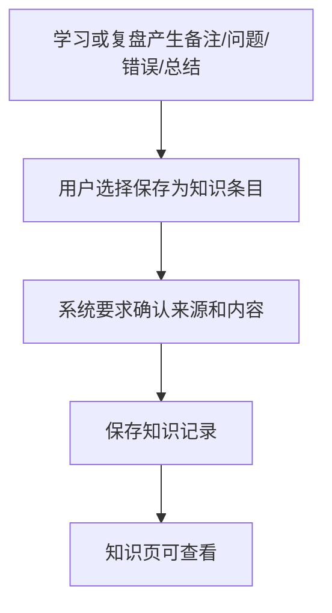

### 入口

- 学习页 session 备注。
- 学习页记录的问题或错误。
- 复盘页 AI 总结。
- 复盘页用户手动补充。
- 计划导入原文中的重要资料。

### 前置条件

- 存在可保存的用户文本、学习记录或复盘结果。
- 用户明确选择保存为知识条目。

### 用户操作

1. 在学习或复盘中选择一段内容。
2. 点击保存为知识条目。
3. 检查或编辑条目内容。
4. 确认保存。
5. 在知识页查看列表。

### 系统反馈

- 显示将保存的来源：
  - task。
  - session。
  - review。
  - raw import。
- 保存成功后提示已进入知识页。
- 知识页展示来源、时间和内容摘要。

### 数据变化

- 创建知识记录。
- 记录来源引用：
  - source type。
  - task id。
  - session id。
  - review id。
  - created at。
- 不改变任务、计划、session 状态。

### 异常情况

- 内容为空：不能保存。
- 来源记录不存在：允许保存为手动知识，但标记来源缺失。
- 数据库写入失败：提示保存失败，不显示已保存。

### 用户取消后的结果

- 取消保存：不创建知识条目。
- 编辑后取消：原学习记录和复盘记录保持不变。
- 不保存为知识：学习 session 或 review 仍按原流程存在。

### 完成状态

- 知识页出现一条可追溯来源的知识记录。
- 该条记录不影响计划和任务状态。
- 未来可作为 RAG 或长期记忆的数据来源。

## 11. 关键跨流程规则

- AI 输出始终是建议，必须经过本地校验。
- AI 不得直接覆盖 confirmed plan。
- confirmed plan 是学习页执行的唯一计划来源。
- 每天只能有一个当前 confirmed plan。
- session 和 block 完成不等于 task 自动完成。
- 复盘必须只使用对应日期的数据。
- 知识条目必须由用户明确保存，不能自动收集私密内容。
- 前台应用和窗口标题属于隐私数据，不应默认发送给 AI。
- 用户取消任何关键确认后，系统应保持原确认计划和原任务状态不变。

## 12. 完成定义

这些流程完成后，V1 应能稳定支持：

```text
首次设置
-> 导入目标
-> 检查任务
-> 生成草稿
-> 确认计划
-> 每日开始学习
-> 暂停/恢复/完成/跳过
-> 复盘
-> 审查 AI 调整建议
-> 形成下一版草稿
-> 保存重要知识条目
```

任何页面或功能如果不能进入上述闭环，应降级为 Future 或从 V1 主流程中移除。
